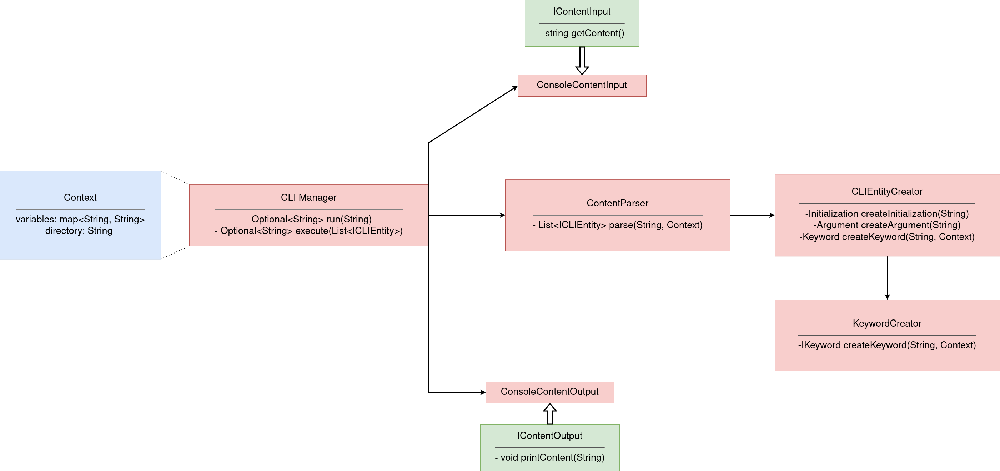
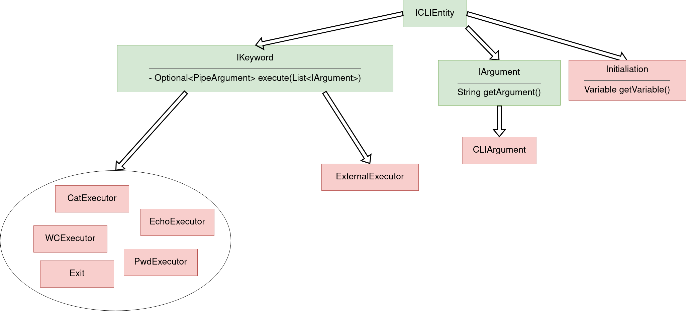

# Архитектура проекта

## Фаза 1.

## Фаза 2.

## Описание компонентов

### I/O компоненты

* `IContentInput` - интерфейс, предоставляющий метод `getContent()`, который возвращает запрос пользователя

* `ConsoleContentInput` - класс, реализующий интерфейс `IContentInput`. Он предоставляет пользовательский запрос, введенный из командной строки

* `IContentOutput` -- интерфейс, предоставляющий метод `printContent(String)`, который позволяет отобразить результат исполнения

* `ConsoleContentOutput` -- класс, реализующий интерфейс `IContentOutput`, предоставляя доступ к отображению в консоли

### Служебные компоненты

* `CLIManager`
    - *(фаза 1 и 2)* класс, который предоставляет методы: 
        + `processInput` - в реализации вызывает метод `getContent()` у `ConsoleContentReader`'a, чтобы получить пользовательский ввод и полученное значение передает ContentParser, чтобы распарсить пользовательский ввод. На выходе получаем List<ICLIEntity>.
        + `execute` *(фаза 1)* - принимает на вход результат работы processInput. Затем выполняет Executor, который находится на первой позиции в листе, передавая ему список из оставшихся `CLIEntity`. В остальных случаях кидаем ParseException.
        + `execute` *(фаза 2)* - принимает на вход результат работы processInput. Затем итеративно разбирает `List<ICLIEntity>`. На каждой итерации мы повторяем такую же логику, как во время фазы 1, но Executor'у передаются аргументы до `PipeArgument` и результат выполнения на предыдущей итерации. Если итерацию не получилось выполнить, то кидаем `ParseException`.
        + `processOutput` - принимает на вход результат выполнения на этапе execute и выводит его, используя `ConsoleContentOutput`

* `VariablesSubstitutor`
    - *(фаза 2)* класс, предоставляющий метод `String substitute(String content, Context context)`, который принимает строчку с запросом пользователя и возвращает преобразованную корректную строчку, совершив все подстановки (`$`). Заметки по реализации:
        + Нужно посимвольно читать ввод (или иначе эмулировать следующие правила), сохраняя текущее состояние (нет кавычек/находимся в одинарных кавычках/находимся в двойных кавычках)
        + Без кавычек (стандартное) - можем войти в любое из следующих состояний, подставляем при `$`
        + При одинарных кавычках - запоминаем состояние и игнорируем подстановки. Можем только выйти из состояния в стандартное.
        + При двойных кавычках - запоминаем состояние и подставляем при `$`. Можем только выйти из состояния в стандартное.

* `ContentParser` 
    - *(фаза 1)* класс, предоставляющий метод `List<ICLIEntity> parse(String content, Context context)`, который принимает строчку с запросом пользователя и `context` (который просто прокидывается дальше),возвращает список сущностей `ICLIEntity`, для создания которых он использует `CLIEntityCreator`. Заметки по реализации:
        + Разделяем строку по пробелам вне кавычек. Создаём сущности через `ICLIEntity`, следуя правилам ниже
        + Начало строки - **keyword**
        + После **keyword** и до конца строки - **arguments**
        + **binary** считается **keyword** на этом этапе
        + Если нет такого **keyword** (в том числе **binary**), который мы получили - считаем, что это **initialization** 

    - *(фаза 2)* класс, предоставляющий метод `List<ICLIEntity> parse(String content, Context context)`, который принимает преобразованную `VariablesSubsitutor` строчку с запросом пользователя и `context` (который просто прокидывается дальше), возвращает список сущностей `ICLIEntity`, для создания которых он использует `CLIEntityCreator`. Заметки по реализации:
        + Разделяем строку по пробелам и **|** вне кавычек. Создаём сущности через `ICLIEntity`, следуя правилам ниже
        + Начало строки или после **|** - **keyword**
        + После **keyword** и до конца строки или **|** - **arguments**
        + **binary** считается **keyword** на этом этапе
        + Если нет такого **keyword** (в том числе **binary**), который мы получили - считаем, что это **initialization** 

* `CLIEntityCreator`
    - *(фаза 1)* класс, предоставляющий методы по созданию сущностей `Initialization`, `Argument`, `Keyword`. `Keyword` пробрасывает `context` дальше, делегирует создание конкретной сущности `KeywordCreator`
    - *(фаза 2)* класс, предоставляющий методы по созданию сущностей `Initialization`, `Argument`, `Pipeline`, `Keyword`. `Keyword` пробрасывает `context` дальше, делегирует создание конкретной сущности `KeywordCreator`

* `KeywordCreator` 
    - *(фаза 1 и 2)* класс, создаёт по строке и `context` соответствующий `IKeyword` и возвращает его

* `CatExecutor`
    - *(фаза 1 и 2)* класс, выполняющий команду `cat`. В реализации считывает содержание файла, переданного на вход первым аргументом и выводит его.

* `EchoExecutor`
    - *(фаза 1 и 2)* класс, выполняющий команду `echo`. Принимает список аргументов *IArgument*, каждый из которых последовательно выводит.

* `PwdExecutor`
    - *(фаза 1 и 2)* класс, выполняющий команду `pwd`. Получает текущую директорию из *KeyWordCreator* и выводит ее.

* `WCExecutor`
    - *(фаза 1 и 2)* класс, выполняющий команду `wc`. Принимает первым аргументом файл, по которому после считывания определяет количество строк, слов и байт.

### Entity иерархия

Данная иерархия существует, чтобы `ContentParser` построил упорядоченный список `ICLIEntity` и мы могли на уровне языка обрабатывать входную команду. Общий интерфейс необходим для того, чтобы поместить все сущности в одну коллекцию.

* `ICLIEntity`
    - *(фаза 1 и 2)* интерфейс описвающий сущности, из которых состоит команда

* `IKeyword`
    - *(фаза 1 и 2)* интерфейс, являющийся `ICLIEntity`, описывающий непосредственно команды (`wc`, `cat` и т.д.). Объявляет метод `Optional<PipeArgument> execute(List<IArgument>)`, позволяющий запустить исполнение команды на данных аргументах и получить соответствующий результат. Заметки по реализации:
        + Порядок аргументов в `List<IArgument>` должен сохраняться таким же, как и в введенной команде, а **pipe**-аргументы должны идти в конец

* `IArgument` 
    - *(фаза 1 и 2)* интерфейс, являющийся `ICLIEntity`, описывающий сущность аргумента, передаваемого в команду. Предоставляет метод `String getArgument()`, возвращающий значение аргумента

* `CLIArgument`
    - *(фаза 1 и 2)* сущность, являющаяся `IArgument`, описывающая аргумент, переданный во время ввода в командной строке

*  `PipeArgument`
    - *(фаза 2)* сущность, являющаяся `IArgument`, описывающая аргумент, переданный с помощью **pipe**'ов. Это разделение необходимо, так как некоторые команды могут игнорировать **pipe**-аргументы при определенных условиях

*  `Pipeline`
    - *(фаза 2)* сущность, являющаяся `ICLIEntity`, описывающая **pipe**, то есть `|` в строке команды

* `Initialization`
    - *(фаза 1 и 2)* сущность, являющаяся `ICLIEntity`, описывающая определение переменной. Предоставляет метод `Pair<String, String> getVariable()`, возвращающий значение для новой/старой переменной. Заметки по реализации:
        + Объявление необходимо исполнять только если нет **pipe**-ов. В противном случае объявление игнорируется (проверено в `bash`).
        
### Exceptions

* `ParseException` - класс, реализующий интерфейс `Exception`. Он возвращает ошибку, возникщую при парсинге. 

* `RunException` - класс, реализующий интерфейс `Exception`. Он возвращает ошибку, возникщую при запуске команд. 
